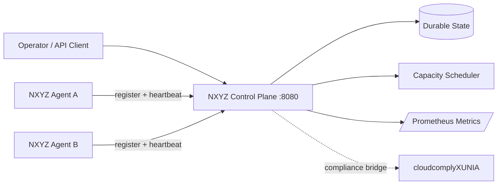

# NXYZ Cloud

**A local-first private cloud control plane that runs on ordinary machines.**

NXYZ Cloud turns a laptop, workstation, homelab, or small server fleet into a visible compute mesh with a control-plane API, heartbeat-based worker agents, capacity-aware workload scheduling, durable state, a live web console, and Prometheus-compatible metrics.

> Status: **functional MVP**. It schedules workload intent and node capacity; it does not yet launch arbitrary OCI containers on remote workers. That execution layer is the next hard boundary, intentionally kept separate from the scheduler.

## What is live now

- **Control plane API** — node registration, heartbeats, inventory, workload scheduling/removal.
- **Worker mesh** — agents self-register and heartbeat; stale nodes are marked offline.
- **Scheduler** — least-loaded placement with CPU + memory admission control.
- **Durable state** — atomic JSON persistence to `/data/state.json`.
- **Operator console** — real-time dashboard at `http://localhost:8080`.
- **Metrics** — Prometheus text endpoint at `/metrics`.
- **Zero paid cloud dependency** — standard Go + Docker Compose.
- **Security plane bridge** — designed to sit beside this repository's existing `cloudcomplyXUNIA` NIST/AWS compliance tooling.

## 60-second launch

```bash
cd nxyz-cloud
docker compose up --build -d
open http://localhost:8080
```

You should see two worker nodes (`Virginia Edge A` and `Virginia Edge B`) register automatically.

Create a workload from the dashboard or API:

```bash
curl -X POST http://localhost:8080/api/v1/workloads \
  -H 'content-type: application/json' \
  -d '{"name":"api","image":"nginx:alpine","cpu_millicores":250,"memory_mb":128}'
```

Run the smoke test:

```bash
make smoke
```

## Architecture



### Mental model for beginners

1. **Control plane = brain.** It knows the nodes and decides placement.
2. **Agent = heartbeat.** Each machine announces capacity and stays alive by checking in.
3. **Scheduler = dispatcher.** It refuses workloads that do not fit and spreads work across healthy nodes.
4. **Dashboard = glass cockpit.** It shows the topology and utilization without requiring CLI knowledge.
5. **Compliance plane = guardrail.** `cloudcomplyXUNIA` remains responsible for AWS/NIST assessment rather than mixing compliance logic into scheduling.

## API

| Method | Endpoint | Purpose |
|---|---|---|
| `GET` | `/healthz` | Control-plane health |
| `GET` | `/api/v1/system` | Cluster summary |
| `GET` | `/api/v1/nodes` | Node inventory |
| `POST` | `/api/v1/nodes/register` | Register/update a node |
| `POST` | `/api/v1/nodes/{id}/heartbeat` | Keep a node healthy |
| `GET` | `/api/v1/workloads` | List workload intents |
| `POST` | `/api/v1/workloads` | Schedule a workload |
| `DELETE` | `/api/v1/workloads/{id}` | Remove workload intent |
| `GET` | `/metrics` | Prometheus metrics |

## Development

```bash
NXYZ_STATE=./.nxyz/state.json go run ./cmd/controlplane
```

In another terminal, start an agent:

```bash
NXYZ_CONTROL_PLANE=http://localhost:8080 \
NXYZ_NODE_ID=mac-node \
NXYZ_NODE_NAME="Local Mac" \
NXYZ_NODE_CPU=4000 \
NXYZ_NODE_MEMORY_MB=8192 \
go run ./cmd/agent
```

## Boundary between MVP and full private cloud

This MVP **schedules** workload intent but does not execute arbitrary images on worker machines. Production execution should be added through a constrained runtime driver (containerd/Docker/Podman), signed workload specs, node authentication, TLS, image policy, and sandboxing. Keeping execution out of the first slice makes the control plane testable before granting agents host-level execution privileges.

## Next implementation layers

- authenticated mTLS node identity and enrollment
- OCI runtime driver for authorized containers
- replicated control-plane storage (Postgres/Raft)
- service discovery + overlay network
- secrets vault and short-lived workload identities
- audit/event stream
- cloudcomply continuous findings ingestion
- Kubernetes-compatible adapter / GitOps bridge
