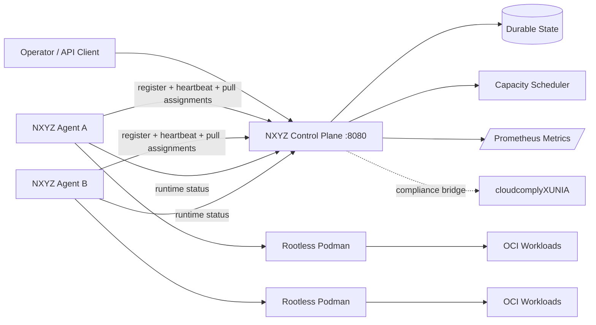

# NXYZ Cloud

**A local-first private cloud control plane that runs on ordinary machines with a zero-license-cost OCI execution path.**

NXYZ Cloud turns a laptop, workstation, homelab, or small server fleet into a visible compute mesh with a control-plane API, heartbeat-based worker agents, capacity-aware scheduling, durable state, a live web console, Prometheus-compatible metrics, and **rootless Podman workload execution**.

> Status: **v0.2 functional execution path**. The control plane schedules workloads, agents pull only their assigned queue, Podman launches the OCI image rootlessly, and agents report `running`, `succeeded`, or `failed` back to the control plane.

## What is live now

- **Control plane API** — node registration, heartbeats, inventory, scheduling, deletion, per-node assignment queues, runtime status updates.
- **Worker mesh** — agents self-register and heartbeat; stale nodes are marked offline.
- **Scheduler** — least-loaded placement with CPU + memory admission control.
- **Free OCI runtime** — rootless Podman; no Docker Desktop subscription, AWS account, Kubernetes service, or paid API is required.
- **Pull-based execution** — workers poll only their own assignments; no remote Docker socket is exposed.
- **Runtime limits** — CPU, RAM, PID limit, private networking, `no-new-privileges`, registry allowlist, and NXYZ ownership labels.
- **Self-healing** — a missing container for an active workload is recreated by the assigned worker.
- **Garbage collection** — deleted or terminal NXYZ containers are removed by the owning agent.
- **Durable state** — atomic JSON persistence to `/data/state.json`.
- **Operator console** — real-time dashboard at `http://localhost:8080`.
- **Metrics** — Prometheus text endpoint at `/metrics`.
- **Optional cluster token** — bearer-token protection for mutation and agent queue endpoints.
- **Security plane bridge** — designed to sit beside this repository's existing `cloudcomplyXUNIA` NIST/AWS compliance tooling.

## Fast local launch — scheduler/dashboard

```bash
cd nxyz-cloud
docker compose up --build -d
open http://localhost:8080
```

The Compose workers intentionally run in **scheduler-only mode** because nesting a host container runtime inside a demo container would weaken the security boundary. The dashboard/control plane still works normally.

## Free executing worker — macOS

Install the open-source Podman CLI/VM once:

```bash
brew install podman
podman machine init --now
```

Then start a real NXYZ executing node from another terminal:

```bash
cd nxyz-cloud
NXYZ_CONTROL_PLANE=http://localhost:8080 \
NXYZ_NODE_ID=mac-exec-1 \
NXYZ_NODE_NAME="Mac Rootless Compute" \
NXYZ_NODE_CPU=4000 \
NXYZ_NODE_MEMORY_MB=8192 \
NXYZ_EXECUTION_ENABLED=true \
./scripts/run-host-agent.sh
```

## Free executing worker — Linux

Install Podman from your distribution package manager, then:

```bash
cd nxyz-cloud
NXYZ_CONTROL_PLANE=http://127.0.0.1:8080 \
NXYZ_NODE_ID=linux-exec-1 \
NXYZ_NODE_NAME="Linux Rootless Compute" \
NXYZ_NODE_CPU=4000 \
NXYZ_NODE_MEMORY_MB=8192 \
NXYZ_EXECUTION_ENABLED=true \
./scripts/run-host-agent.sh
```

Podman rootless mode uses a user namespace rather than granting the NXYZ agent root access.

## Protect a multi-machine cluster for free

Generate one shared cluster token locally:

```bash
export NXYZ_CLUSTER_TOKEN="$(openssl rand -hex 32)"
```

Pass the same value to the control plane and every NXYZ agent. Mutation endpoints and agent assignment/status endpoints then require:

```text
Authorization: Bearer <NXYZ_CLUSTER_TOKEN>
```

For a single-machine deployment, Compose exposes the web/API port on `127.0.0.1` only.

## Create a real workload

With an executing Podman node registered, create a workload from the dashboard or API:

```bash
curl -X POST http://localhost:8080/api/v1/workloads \
  -H 'content-type: application/json' \
  -d '{"name":"web","image":"nginx:alpine","cpu_millicores":250,"memory_mb":128}'
```

If `NXYZ_CLUSTER_TOKEN` is enabled:

```bash
curl -X POST http://localhost:8080/api/v1/workloads \
  -H "Authorization: Bearer $NXYZ_CLUSTER_TOKEN" \
  -H 'content-type: application/json' \
  -d '{"name":"web","image":"nginx:alpine","cpu_millicores":250,"memory_mb":128}'
```

The agent normalizes unqualified images such as `nginx:alpine` to `docker.io/library/nginx:alpine`. Default allowed registries are `docker.io`, `ghcr.io`, and `quay.io`. Override them with `NXYZ_ALLOWED_REGISTRIES`.

## Architecture



### Execution flow

1. Operator submits an OCI workload.
2. Scheduler places it on the least-loaded healthy node with enough CPU/RAM.
3. That node's agent pulls its assignment queue.
4. The agent validates/normalizes the image reference and checks the registry allowlist.
5. Podman launches the container with CPU/RAM/PID constraints and private networking.
6. The agent reports `running`, `succeeded`, or `failed`.
7. Terminal workloads release scheduler capacity automatically.
8. Deleted/terminal containers are garbage-collected by the owning worker.

## API

| Method | Endpoint | Purpose |
|---|---|---|
| `GET` | `/healthz` | Control-plane health |
| `GET` | `/api/v1/system` | Cluster summary |
| `GET` | `/api/v1/nodes` | Node inventory |
| `POST` | `/api/v1/nodes/register` | Register/update a node |
| `POST` | `/api/v1/nodes/{id}/heartbeat` | Keep a node healthy |
| `GET` | `/api/v1/nodes/{id}/workloads` | Assigned queue for one worker |
| `GET` | `/api/v1/workloads` | List workloads and runtime state |
| `POST` | `/api/v1/workloads` | Schedule a workload |
| `POST` | `/api/v1/workloads/{id}/status` | Assigned worker reports runtime state |
| `DELETE` | `/api/v1/workloads/{id}` | Delete workload intent; agent GC removes container |
| `GET` | `/metrics` | Prometheus metrics |

## Development

```bash
NXYZ_STATE=./.nxyz/state.json go run ./cmd/controlplane
```

In another terminal:

```bash
NXYZ_CONTROL_PLANE=http://localhost:8080 \
NXYZ_NODE_ID=local-node \
NXYZ_NODE_NAME="Local Rootless Node" \
NXYZ_NODE_CPU=4000 \
NXYZ_NODE_MEMORY_MB=8192 \
go run ./cmd/agent
```

`NXYZ_EXECUTION_ENABLED=auto` is the default: if `podman` is in `PATH`, OCI execution activates; otherwise the node remains scheduler-only. Set it to `true` to fail fast when Podman is missing, or `false` for heartbeat/scheduler-only operation.

## Security boundary

NXYZ does **not** expose Podman's unauthenticated TCP service and does not give the control plane arbitrary shell execution. Agents use the local Podman CLI, pull declarative workload assignments, accept no host mount/device/privileged fields from the API, and constrain resources before launch.

For internet-exposed or higher-assurance clusters, the next hardening layer is mTLS node enrollment plus signed workload specs. For larger Kubernetes-compatible fleets, K3s is the free/open-source fallback path: it bundles containerd, networking, DNS, ingress/load balancing, network policy, and local persistent-volume support in a lightweight Kubernetes distribution.

## Validation

```bash
make test
make smoke
```

CI builds the controller and agent, runs unit tests and vet, and builds both container targets.

## Next implementation layers

- mTLS node certificates and enrollment
- signed workload specifications / image verification policy
- replicated control-plane storage (Postgres/Raft)
- service publishing and explicit port policy
- secrets vault and short-lived workload identities
- audit/event stream
- cloudcomply continuous findings ingestion
- optional K3s adapter for larger multi-node clusters
